# Binary Parsing

Binary formats are not human readable, meaning we must parse them using code to
discover the information inside. We use a library called Swift Binary Parsing to
do this.

Resource: [Getting Started with
BinaryParsing](https://apple.github.io/swift-binary-parsing/documentation/binaryparsing/gettingstarted)

# CLI metadata format

There are two ways metadata is stored in WinMD files:

1.  Tables (arrays of records) - ECMA-335 page 235

2.  Heaps - ECMA-335 page 298

Heaps are unstructured data regions, so information can only be extracted if you
know its position and size within the heap.

Tables have a variable number of rows, which have a defined number of fixed-size
columns. Tables, rows, and columns are all packed consecutively. Each table
represents a concept in an API; for example, the 'Field' table represents a
field in a type definition, while the 'FieldLayout' table represents the layout
of fields in a type.

There are two types of columns in table rows:

1.  Constant - A literal value or bitmask

2.  Index - An index to a row in the same or another table.

A bitmask constant stores multiple values in each byte, each of which can be accessed
using a bitmask that isolates the bits of interest.

There are two types of indices:

1.  Simple - an index into one, and only one, table
2.  Complex - an index into one of several tables. A few bits of the index value
    are reserved to define which table it targets.
