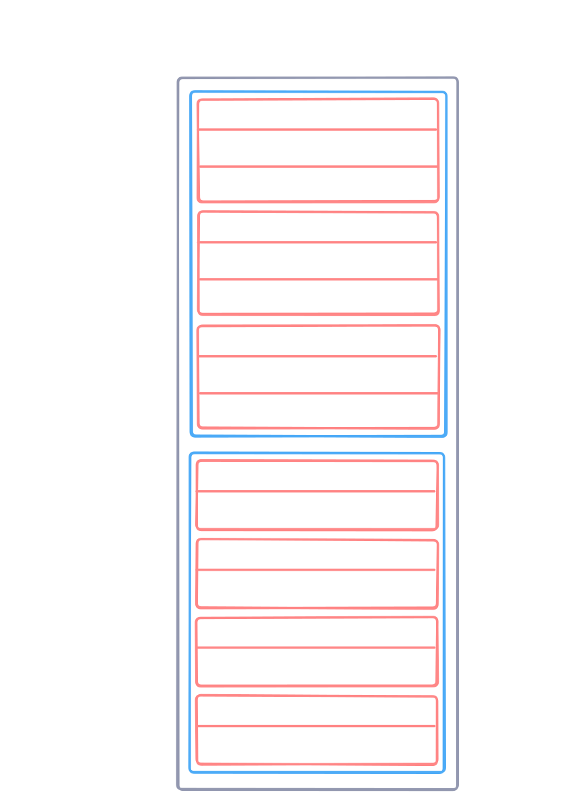

# Binary Parsing

Binary formats are not human readable, meaning we must parse them using code to
discover the information inside. We use a library called Swift Binary Parsing to
do this.

Resource: [Getting Started with
BinaryParsing](https://apple.github.io/swift-binary-parsing/documentation/binaryparsing/gettingstarted)

# CLI metadata format

Unless otherwise stated, the format is in little endian.

There are two ways metadata is stored in WinMD files:

1.  Tables (arrays of records)

2.  Heaps

# Tables

> See ‘§II.22 Metadata logical format: tables’ for more information

A table has a variable number of rows with a defined set of columns. The size of
each row is known, so we can multiply it by a row index to get the offset for
that row. This allows table rows to link to each other using indices for O(1)
lookups.

There are two types of columns in table rows:

1.  Constant - A literal value or bitmask

2.  Index - An index to a row in the same or another table.

A bitmask constant stores multiple pieces of information in each byte, each of
which can be accessed using a bitmask that isolates the bits of interest.

There are two types of indices:

1.  Simple - an index into one, and only one, table
2.  Coded - an index into one of several tables. A few bits of the index value
    are reserved to define which table it targets.

Indices are 1-based because an index of zero is reserved to mean a null index
that does not index a row at all.

## List columns

ECMA-335 defines ‘list’ columns where in a given table X it is equal to an index
into another table Y. This index marks the first of a contiguous run of rows in
table Y owned by this row in table X. The run continues to the smaller of:

- the last row of table Y

- the next run of table Y rows, found by inspecting the same list column of the
  next row in table X

Examples include the `FieldList` and `MethodList` columns in ԤII.22.37
TypeDef’.

Some list columns, such as the above examples, are allowed to be null by the
spec. In this scenario, a parser would need to scan to find the next row in
table X with a non-null index for the same list column, not just inspect the
next row. However, Windows Metadata does not use null indices for list columns,
instead using an index equal to the index of the next row to mean an empty
range. This is evidenced by windows-rs which assumes the list column of the next
row is non-null
([source](https://github.com/microsoft/windows-rs/blob/a1e9fce43c026221f62f0a149267cb6d7d3c607b/crates/libs/metadata/src/reader/file.rs#L523-L538)).

I found this edge case when introducing the `Index` type which conforms to
`RawRepresentable` and has a failable initializer that returns nil when the raw
value is 0. This is an application of the [“parse, don’t
validate”](https://lexi-lambda.github.io/blog/2019/11/05/parse-don-t-validate/)
idiom by Alexis King:

- Validation (the brittle way): Checking `if index == 0` at the point of use. If
  you forget the check, the code still compiles, but breaks at runtime when you
  resolve the index.

- Parsing (the robust way): Consuming the raw value, checking for 0, and
  returning an `Index?`. Now, the type itself (`Index` vs `Optional<Index>`)
  proves the value is non-zero. You cannot use it to look up a row without the
  compiler forcing you to acknowledge the possibility of absence.

I did not consider this edge case when originally writing the list function
using raw Int indices, until the Index type made me realise that the list column
in the next row could be null. This shows how encoding constraints in the type
system allows the compiler to reveal logical consequences you have not
considered.

While this edge case will not arise in Windows Metadata, I kept my handling of
it as a record of this realisation.

# Heaps

> See ‘§II.24.2.2 Stream header’ for more information.

Heaps are variable-length data regions where data is accessed via a byte offset.
The length or end of data in a heap is needed to know where to stop reading.

## String heap

The string heap contains null-terminated UTF-8 strings.

## Blob heap

The blob heap stores variable-length data in non-normalised, contiguous binary
objects called blobs. A blob stores its length in the first few bytes.

For example, method signatures describe the types of parameters of a method and
the type of its return value. They are stored in blobs because they can have any
number of parameters and cannot fit in a fixed-size table row.

The length prefix of blobs and integers within signatures are compressed using a
variable-length encoding; the first few bits signal the total byte length of the
number so that smaller numbers can be represented using fewer bytes. Compressed
integers are encoded in big-endian (i.e. with the most significant byte at the
smallest offset within the file) so that the length bits can be read first.

# Notation

> See ‘§II.5 General Syntax’ for more information.

The spec uses a modified form of the [Backus-Naur
form](https://en.wikipedia.org/wiki/Backus–Naur_form) syntax notation to
describe the structure of signatures. Here is a summary:

- `::=` means “is defined as”

- `|` means OR

- `*` means one or more of the preceding element

The spec also uses [Syntax
Diagrams](https://en.wikipedia.org/wiki/Syntax_diagram).

- Parallel tracks represent alternatives

- Looped tracks mean one or more
